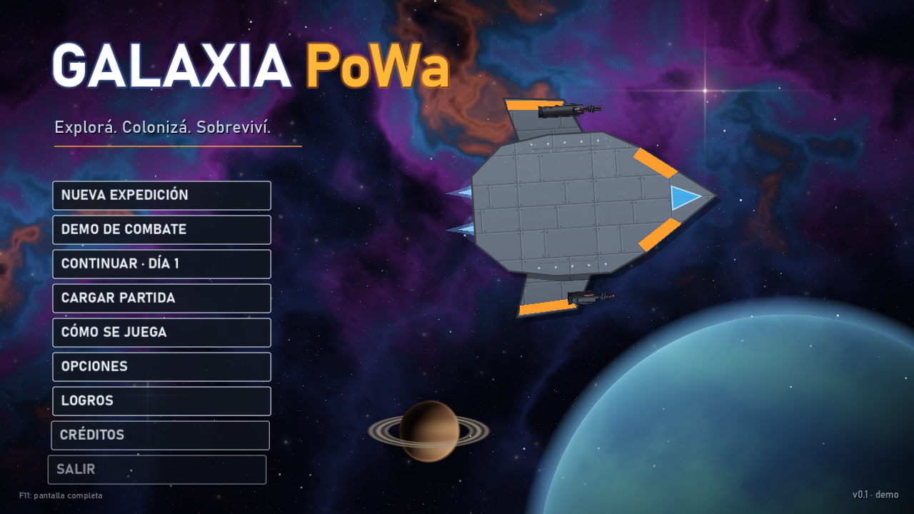
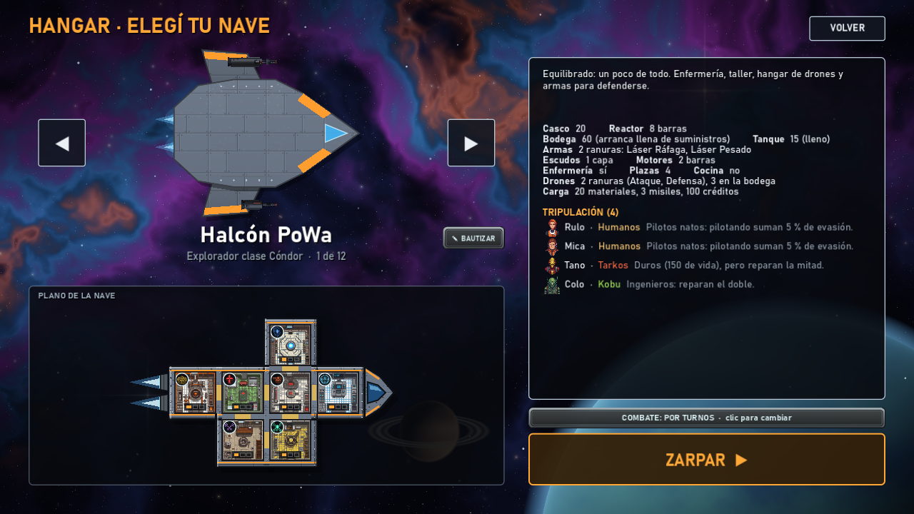
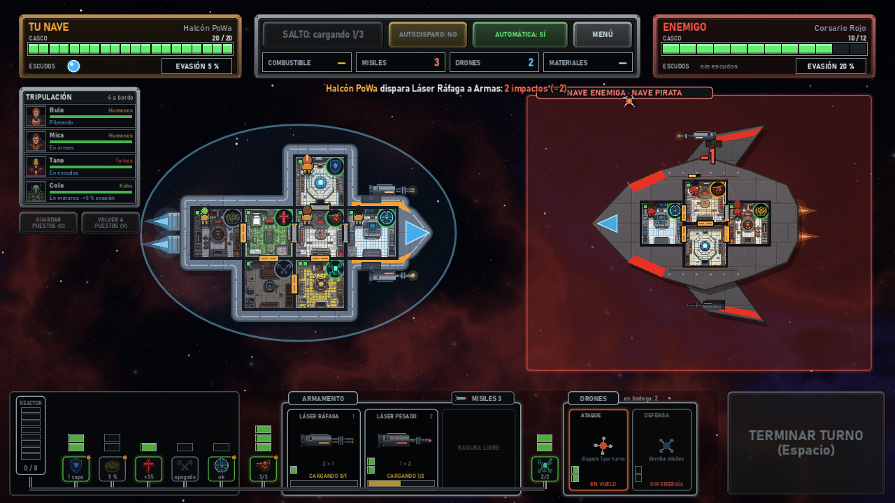
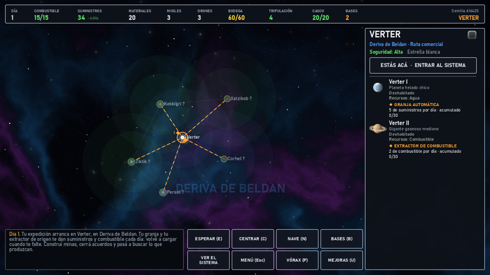
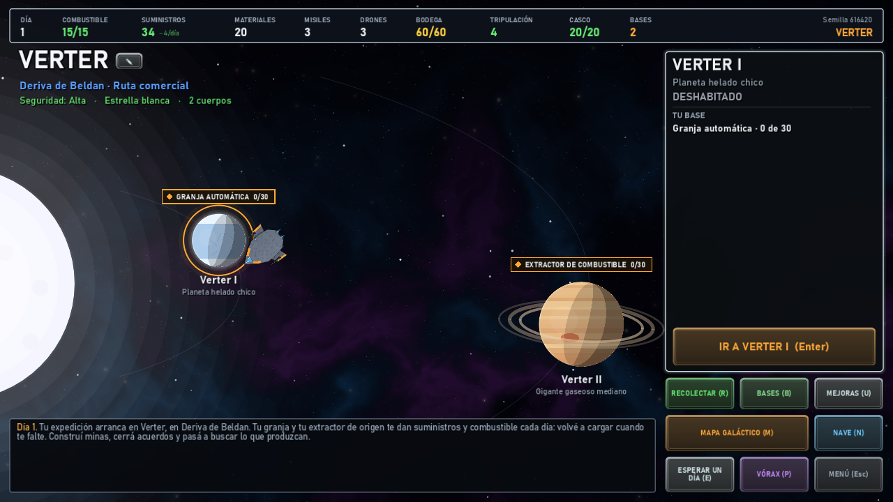
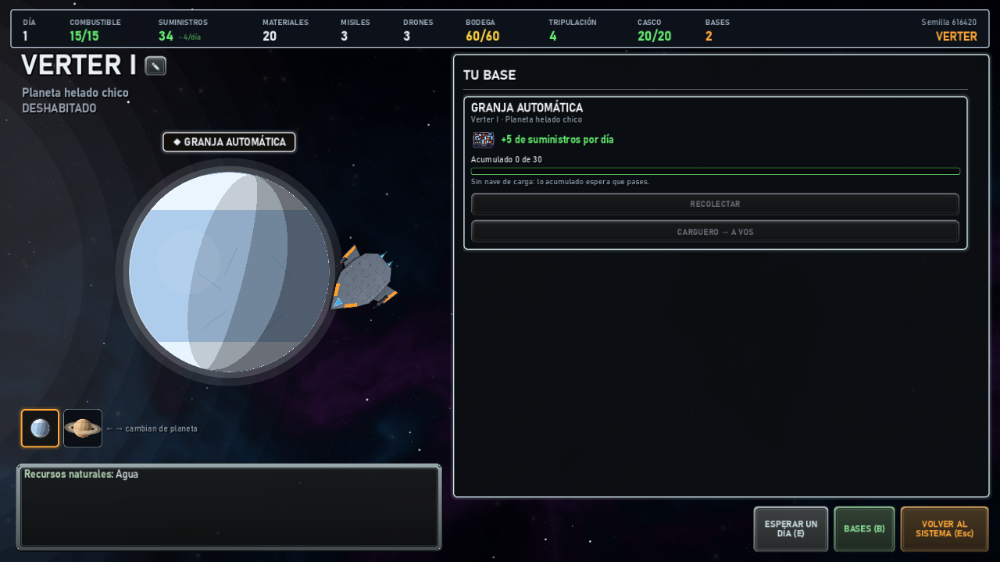
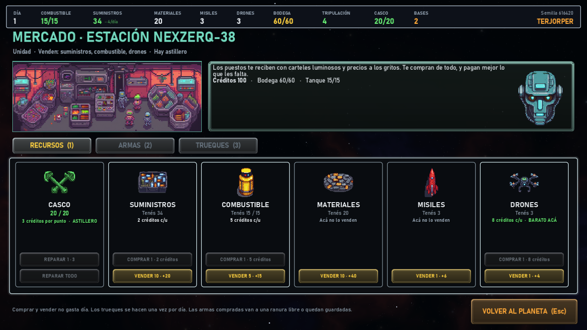
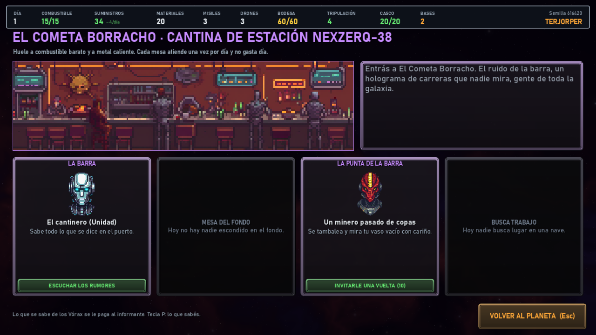

# Galaxia PoWa

**Exploración espacial por turnos.** Viajá por una galaxia procedural, sobreviví (comida, combustible, casco),
comerciá, fundá bases y colonias, peleá contra piratas nave contra nave y encontrá la Colmena Madre de los Vórax
antes de que ella te encuentre a vos.

## Descargar

**[Descargá la demo v0.1](https://github.com/sebapowa/GalaxiaPoWa/releases/latest)** (Windows 10 u 11, 64 bits, 39 MB).

1. Bajá `GalaxiaPoWa_v0.1.zip` y descomprimilo.
2. Abrí `Galaxia PoWa.exe`. No hace falta instalar nada.

> Windows puede mostrar un aviso de SmartScreen porque el juego no está firmado: tocá **Más información → Ejecutar de todos modos**.

## Qué trae la demo

- **Una galaxia nueva en cada partida**: unos 140 sistemas en seis regiones, con planetas, razas, estaciones y zonas sin ley.
- **Supervivencia**: cada salto es un día; la tripulación come, el combustible se gasta y el casco se repara en los mercados.
- **Combate nave contra nave** por turnos o en tiempo real con pausa: energía del reactor, escudos, armas, drones y una tripulación que repara, cura y pilotea.
- **Bases y colonias**: minas, depósitos, naves de carga, terraformadores y colonias que crecen, pagan impuestos y atraen piratas.
- **Cantinas y mercados**: rumores, informantes, gente para contratar, trueques y armas.
- **Oficios** para tu tripulación, que con los días se vuelve experta y maestra.
- **12 naves**: tres para empezar y nueve que se desbloquean con logros.
- **Todo con nombre propio**: bautizá planetas, sistemas, tu nave y a tu gente.
- **Guardado** automático y tres ranuras para guardar a mano.

| | |
|---|---|
|  |  |
|  |  |
|  |  |
|  | |

## Estado

Es una **demo**: todavía no tiene sonido y el balance es el primero. Si encontrás algo raro, avisale a SeBaPoWa.

## Créditos

- Idea, diseño y dirección: **SeBaPoWa**
- Programación, arte procedural y armado del arte: Claude (Anthropic)
- Hecho con [Godot Engine](https://godotengine.org)

## Licencia

© 2026 SeBaPoWa. Todos los derechos reservados: se puede descargar y jugar gratis, pero no copiar, modificar
ni redistribuir. Ver [LICENCIA.txt](LICENCIA.txt), con los avisos de los componentes de terceros.
